## vs code download pananu
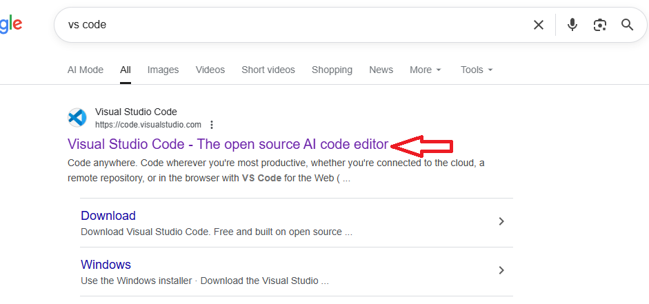
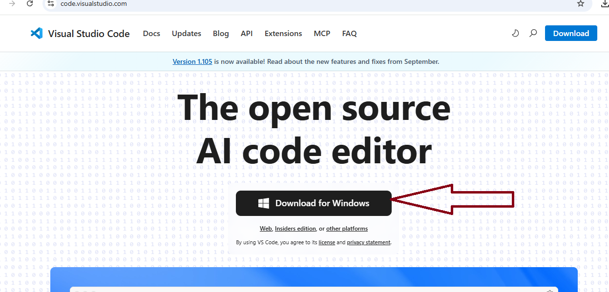
## desktop la new folder create pananu

## open vs code
### click file and select open folder
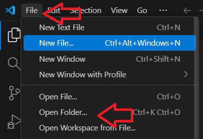
### open the folder
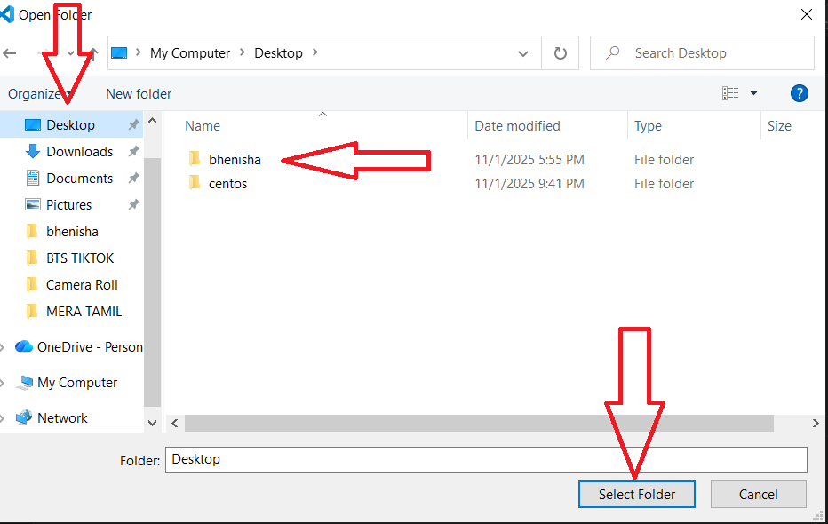
##  vs code la new file create pananu, file ku name kudukanum
### sekect file
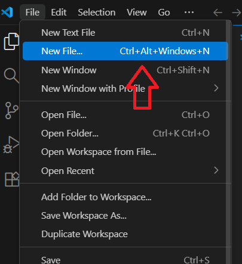
### give file name readme.md
```sh
Readmd.md
```
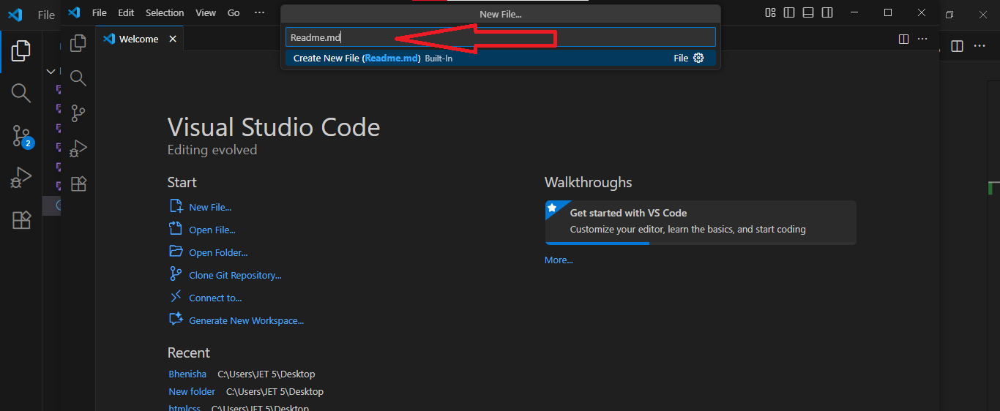
### Write the documentation in the readme file
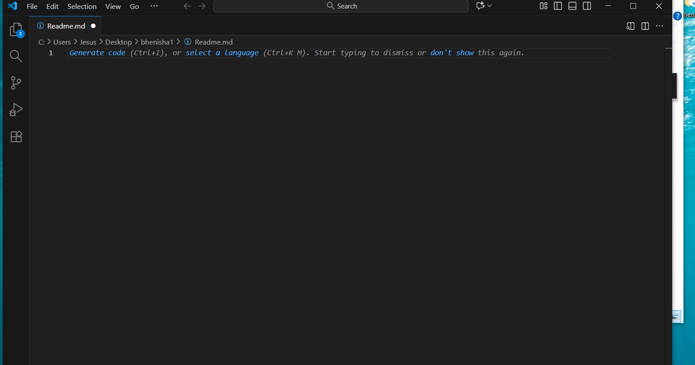
## repositories create pananum
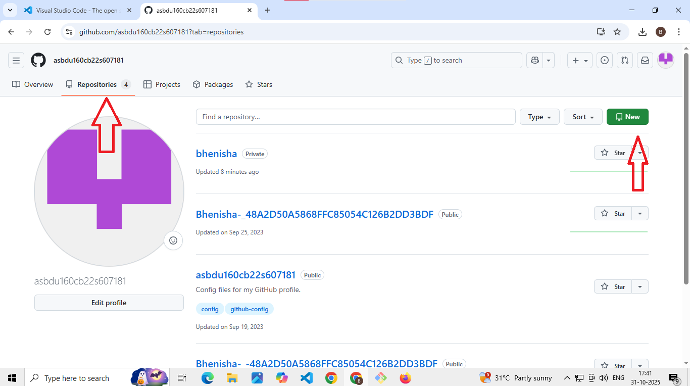
### give repositories name and create repositoies
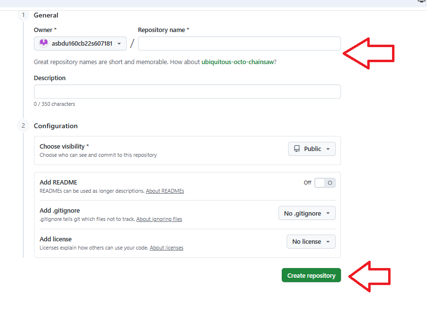
##  git command
### rigt click 
### use git command
### select git bash 
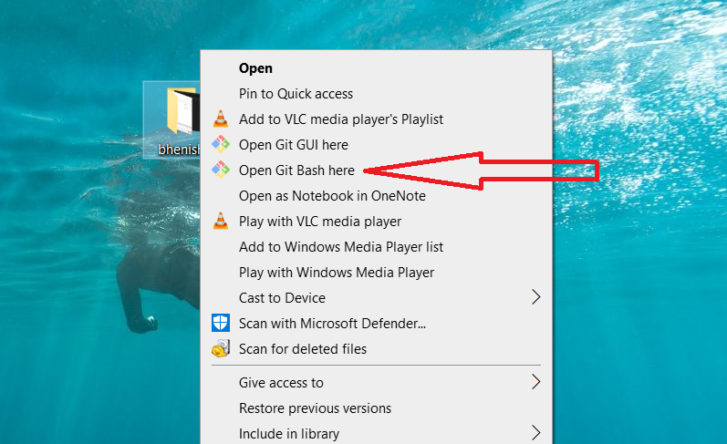
### git bash command page
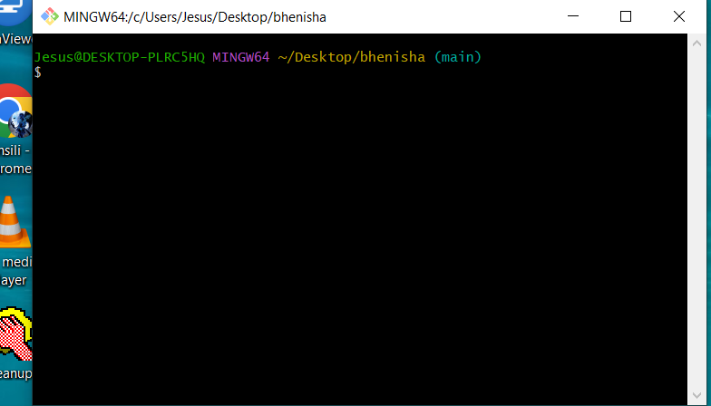
### git command
```sh
git init
```
```sh
git add .
```
```sh
git commit -m "commit"
```
### middle la mail id kedukura mathiri varum for verification
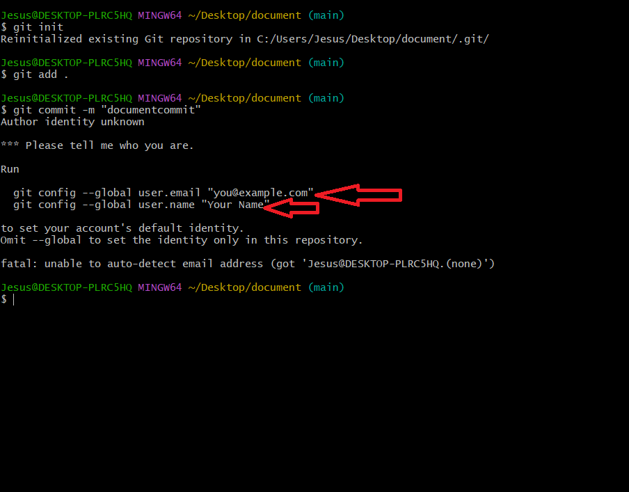

```sh
git branch -M main
```
### github 
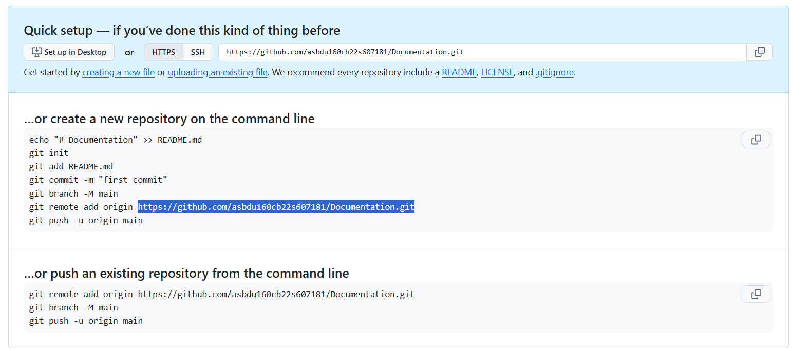
```sh
git remote add origin https://github.com/asbdu160cb22s607181/Documentation.git
```
```sh
git push -u origin main
```
##  Update the repo
```sh
git add .
```
```sh
git commit -m"firstcommit"
```
```sh
git push -u origin main
```
## this way to create the github documentation
# *** Thank you! ***
                              